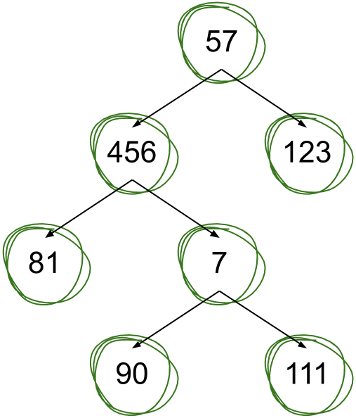

> WARNING: this is just my experiment I work on in my free time. Do **NOT** rely on it.

# poica
[](https://github.com/hirrolot/poica/actions?query=workflow%3A%22C%2FC%2B%2B+CI%22)
[](https://github.com/hirrolot/poica/releases/tag/v0.4.0)
[](SPEC.md)

## Table of contents
 - [Motivation](#motivation)
 - [Features](#features)
 - [Installation](#installation)
 - [ADTs (algebraic data types)](#adts-algebraic-data-types)
   - [Motivation](#motivation-2)
   - [Sum types](#sum-types)
   - [Product types](#product-types)
 - [Type introspection](#type-introspection)
   - [Motivation](#motivation-3)
   - [Sum types](#sum-types-1)
   - [Product types](#product-types-1)
 - [Safe, consistent error handling](#safe-consistent-error-handling)
 - [Built-in ADTs](#built-in-adts)
 - [OOP](#oop)
   - [Interfaces & dynamic dispatch](#interfaces--dynamic-dispatch)
 - [Type-generic programming](#type-generic-programming)
   - [Motivation](#motivation-1)
   - [Generic types](#generic-types)
   - [HKTs (higher-kinded types)](#hkts-higher-kinded-types)
   - [GADTs (generalised ADTs)](#gadts-generalised-adts)
   - [Type-safe HOAS (higher-order abstract syntax)](#type-safe-hoas-higher-order-abstract-syntax)
 - [Options](#options)
 - [Roadmap](#roadmap)
 - [FAQ](#faq)

## Motivation

Programming (especially in C!) is notoriously error-prone. The bad thing is that a part of the programmer's mistakes is usually detected during testing, and another part goes to production, leaving our users with improperly working devices and making business lose money.

The good news are that many kinds of mistakes can be detected during compilation, thereby:

 - Improving safety of our software;
 - Increasing execution speed by eliminating run-time assertions.

Powerful type systems are good for this, because they limit ranges of values that can be assigned to variables. Unfortunately, C has a very weak type system, which is unable to express most of business logic constraints between communicating software components. To resolve the situation, poica imitates various features from modern type systems via the macro system of C. The further explanations and examples will convey the key ideas to you!

## Features
 - C11-compliant
 - Can work on bare-metal environments
 - Comes with the [specification]
 - No third-party code generators, just `#include <poica.h>` and go!

[specification]: https://github.com/hirrolot/poica/blob/master/SPEC.md

## Installation

The recommended way is using [Git submodules]. Enter your project and execute:

```sh
git submodule add -b master https://github.com/hirrolot/poica
git submodule update --init --recursive
```

And `#include <poica.h>` inside your source files to export poica's public API (using the `-I` compiler option). Building isn't required, because poica is a header-only library.

If you're using GCC, appending `-ftrack-macro-expansion=0` would increase compilation time and reduce memory consumption.

[Git submodules]: https://git-scm.com/book/en/v2/Git-Tools-Submodules

## ADTs (algebraic data types)

[ADTs] provide a convenient approach to combine, destruct, and introspect data types. There are two main kinds of them: **sum types** and **product types**.

Simply put, a **sum type** is _either_ of `T1`, ..., `Tn`, and a **product type** is _both_ `T1`, ..., `Tn`. Another name of sum types is a [tagged union], and product types correspond to structures in C.

[Pattern matching] is checking each variant of a sum type, and, if a matched variant is an actual one, trigger some action. They are like `if` statements, but for sum types, rather than for boolean expressions.

[algebraic data types]: https://en.wikipedia.org/wiki/Algebraic_data_type

[tagged union]: https://en.wikipedia.org/wiki/Tagged_union

[Pattern matching]: https://en.wikipedia.org/wiki/Pattern_matching
[pattern matching]: https://en.wikipedia.org/wiki/Pattern_matching

They have tremendous amount of applications to real-world programming, including:

 - [Safe, consistent error handling](#safe-consistent-error-handling)
 - Compiler construction: [tokens](examples/tokens.c) & [AST evaluation](examples/ast.c)
 - Concurrency: [message passing](examples/message_passing.c)

[ADTs]: https://en.wikipedia.org/wiki/Algebraic_data_type

[_The algebra (and calculus!) of algebraic data types_](https://codewords.recurse.com/issues/three/algebra-and-calculus-of-algebraic-data-types) by [Joel Burget](https://codewords.recurse.com/about#Joel%20Burget) presents some theory behind ADTs.

### Motivation

Usually in C we use unions to tell a compiler that we're going to interpret a single memory region in different ways. To decide how to interpret a union, we endow it with a tag and get a [tagged union].

However, there'll be quite lot of duplication in code:

```c
typedef struct {
    enum {
        OUR_TAGGED_UNION_STATE_1,
        OUR_TAGGED_UNION_STATE_2,
        OUR_TAGGED_UNION_STATE_3,
    } state;

    union {
        int state_1;
        const char *state_2;
        double state_3;
    } data;
} OurTaggedUnion;
```

What's even worse is that this approach is unsafe, meaning that we can construct invalid `OurTaggedUnion` (i), or, for example, (ii) access `data.state_1` when the actual state is `OUR_TAGGED_UNION_STATE_3`:

```c
// (i)
OurTaggedUnion res1 = { .state = OUR_TAGGED_UNION_STATE_2, .data.state_1 = 123 };

// (ii)
OurTaggedUnion res2 = { .state = OUR_TAGGED_UNION_STATE_3, .data.state_3 = .99 };
some_procedure(res2.data.state_1);
```

poica solves these two problems by introducing [algebraic data types] (discussed in the next section). That's how it's accomplished with poica:

```c
choice(
    OurTaggedUnion,
    variant(State1, int)
    variant(State2, const char *)
    variant(State3, double)
);

// (i) Compilation failed!
OurTaggedUnion res1 = State2(123);

OurTaggedUnion res2 = State3(.99);
some_procedure(/* Impossible to pass state_1! */);
```

### Sum types

For example, a [binary tree] like this:

[binary tree]: https://en.wikipedia.org/wiki/Binary_tree

<div align="center">
  
</div>

Can be conveniently represented as a sum type and further manipulated using pattern matching. In the code below we first construct this binary tree, and then print all its elements to `stdout`:

[[`examples/binary_tree.c`](examples/binary_tree.c)]
```c
#include <poica.h>

#include <stdio.h>

choice(
    Tree,
    variant(Empty)
    variant(Leaf, int)
    variantMany(Node,
        field(left, struct Tree *)
        field(number, int)
        field(right, struct Tree *)
    )
);

void print_tree(const Tree *tree) {
    match(*tree) {
        of(Empty) {
            return;
        }
        of(Leaf, number) {
            printf("%d\n", *number);
        }
        ofMany(Node, (left, number, right)) {
            print_tree(*left);
            printf("%d\n", *number);
            print_tree(*right);
        }
    }
}

#define TREE(tree)                obj(tree, Tree)
#define NODE(left, number, right) TREE(Node(left, number, right))
#define LEAF(number)              TREE(Leaf(number))

int main(void) {
    const Tree *tree =
        NODE(NODE(LEAF(81), 456, NODE(LEAF(90), 7, LEAF(111))), 57, LEAF(123));

    print_tree(tree);
}
```

<details>
    <summary>Output</summary>

```
81
456
90
7
111
57
123
```

</details>

### Product types

If we have structures in C, why do we need product types? Well, because product types provide type introspection (discussed in the next section). A product type is represented like this:

```c
record(
    UserAccount,
    field(name, const char *)
    field(balance, double)
    field(age, unsigned char)
);
```

And it can be further manipulated like an ordinary structure:

```c
UserAccount user = {"Gandalf", 14565.322, 715};
user.name = "Mithrandir";
user.age++;
user.balance *= 2;
```

## Type introspection

[Type introspection] is supported in the sense that you can query the type properties of ADTs at compile-time and then handle them somehow in your hand-written macros.

[Type introspection]: https://en.wikipedia.org/wiki/Introspection_(computer_science)
[type introspection]: https://en.wikipedia.org/wiki/Introspection_(computer_science)

### Motivation

Sometimes it's desirable not to only declare new data types, but also to introspect their inner structure. Type introspection makes possible such things as these:

 - [Type-driven (de)serialization]
 - [Type-driven command-line arguments parsing]

And more (planned!).

[type-driven (de)serialization]: https://github.com/serde-rs/json
[type-driven command-line arguments parsing]: https://github.com/clap-rs/clap

### Sum types

[[`examples/introspection/choice.c`](examples/introspection/choice.c)]
```c
#include <poica.h>

#include <stdio.h>

#include <boost/preprocessor.hpp>

#define MY_CHOICE                                                           \
    Something,                                                              \
    variant(A)                                                              \
    variant(B, int)                                                         \
    variantMany(C, field(c1, double) field(c2, char))

choice(MY_CHOICE);
#define Something_INTROSPECT POICA_CHOICE_INTROSPECT(MY_CHOICE)

int main(void) {
    puts(BOOST_PP_STRINGIZE(Something_INTROSPECT));
}
```

<details>
    <summary>Output</summary>

```
((POICA_VARIANT_KIND_EMPTY)(A))
((POICA_VARIANT_KIND_SINGLE)(B)(int))
((POICA_VARIANT_KIND_MANY)(C)( ((c1)(double)) ((c2)(char)) ))
```

</details>

### Product types

[[`examples/introspection/record.c`](examples/introspection/record.c)]
```c
#include <poica.h>

#include <stdio.h>

#include <boost/preprocessor.hpp>

#define MY_RECORD                                                           \
    Something,                                                              \
    field(a, int)                                                           \
    field(b, const char *)                                                  \
    field(c, double)

record(MY_RECORD);
#define Something_INTROSPECT POICA_RECORD_INTROSPECT(MY_RECORD)

int main(void) {
    puts(BOOST_PP_STRINGIZE(Something_INTROSPECT));
}
```

<details>
    <summary>Output</summary>

```
((a)(int)) ((b)(const char *)) ((c)(double))
```

</details>

That is, the metainformation about types is actually a [sequence] in the terms of [Boost/Preprocessor]. So the [`BOOST_PP_SEQ_*` macros] can be used further, as well as [other utility macros](https://github.com/hirrolot/poica/blob/master/SPEC.md) from poica.

[sequence]: https://www.boost.org/doc/libs/1_53_0/libs/preprocessor/doc/data/sequences.html
[Boost/Preprocessor]: https://www.boost.org/doc/libs/1_53_0/libs/preprocessor/doc/
[`BOOST_PP_SEQ_*` macros]: https://www.boost.org/doc/libs/1_53_0/libs/preprocessor/doc/headers/seq.html

## Safe, consistent error handling

ADTs provide a safe, consistent approach to error handling. A procedure that can fail returns a sum type, designating either a successful or a failure value, like this:

```c
typedef enum RecvMsgErrKind {
    BAD_CONN,
    NO_SUCH_USER,
    ...
} RecvMsgErrKind;

typedef const char *Msg;

DefRes(Msg, RecvMsgErrKind);

P(Res, Msg, RecvMsgErrKind) recv_msg(...) { ... }
```

And then `P(Res, Msg, RecvMsgErrKind)` can be matched to decide what to do in the case of `P(Ok, Msg, RecvMsgErrKind)` and `P(Err, Msg, RecvMsgErrKind)`:

```c
P(Res, Msg, RecvMsgErrKind) res = recv_msg(...);
match(res) {
    of(P(Ok, Msg, RecvMsgErrKind), msg) { ... }
    of(P(Err, Msg, RecvMsgErrKind), err_kind) { ... }
}
```

But why this is better than `int` error codes? Because of:

 - **Readability.** Such identifiers as `Ok` and `Err` are more for humans, and therefore, it's much harder to confuse them with each other. In contrast to this, the usual approach in C to determine an error is by using magic ranges (for example, <0 or -1).

 - **Consistency.** No need to invent different strategies to handle different kinds of errors (i.e. using exceptions for less likely errors, `int` codes for a normal control flow, ...); ADTs address the problem of error handling generally.

 - **Exhaustiveness checking (case analysis).** A smart compiler and static analysis tools ensure that all the variants of `Res` are handled in `match`, so we can't forget to handle an error and make a possibly serious bug by leaving an application work as there's no error, when there is.

ADTs even have advantages over exceptions: they do not perform transformations with a program stack, since they are just values with no implicit logic that can hurt performance.

See [`examples/error_handling.c`](examples/error_handling.c) as an example of error handling using ADTs.

## Built-in ADTs

| ADT | Description | Example |
|-----|-------------|---------|
| `Maybe` | An optional value | [`examples/maybe.c`](examples/maybe.c) |
| `Either` | Either this value or that | [`examples/either.c`](examples/either.c) |
| `Pair` | A pair of elements | [`examples/pair.c`](examples/pair.c) |
| `Res` | Either a successful or a failure value | [`examples/error_handling.c`](examples/error_handling.c) |

The last one has been presented in the previous section. All these generic types share the common API:

```c
// Generate a definition of an ADT.
DefX(T1, ..., Tn);

// Generate a type name.
P(X, T1, ..., Tn) = ...;
```

The utility functions can be found in the [specification].

## OOP

### Interfaces & dynamic dispatch

[Dynamic dispatch] is a feature of [object-oriented programming], which allows executing methods from possibly different implementations on the same object (their interface) via a [virtual method table (VTable)]. The following example illustrates the functionality:

[[`examples/dyn_dispatch.c`](examples/dyn_dispatch.c)]
```c
#include <poica.h>

#include <stdio.h>

interface(
    Animal,
    void (*noise)(void *self);
);

record(Dog, field(counter, int));
record(Cat, field(counter, int));

impl(
    (Animal) for (Dog),
    (void)(noise)(void *self)(
        Dog *dog = (Dog *)self;
        dog->counter++;
        printf("Woof! Counter: %d\n", dog->counter);
    )
);

impl(
    (Animal) for (Cat),
    (void)(noise)(void *self)(
        Cat *cat = (Cat *)self;
        cat->counter++;
        printf("Meow! Counter: %d\n", cat->counter);
    )
);

int main(void) {
    Dog dog = {.counter = 0};
    Cat cat = {.counter = 0};

    AnimalMut animal;

    animal = P(newIObj, AnimalMut, Dog)(&dog);

    vCall(animal, noise);
    vCall(animal, noise);
    vCall(animal, noise);

    animal = P(newIObj, AnimalMut, Cat)(&cat);

    vCall(animal, noise);
    vCall(animal, noise);
}
```

<details>
    <summary>Output</summary>

```
Woof! Counter: 1
Woof! Counter: 2
Woof! Counter: 3
Meow! Counter: 1
Meow! Counter: 2
```

</details>

In fact, interfaces are available without dynamic dispatch too. Just call `iMethods(MyInterface, MyImplementerType).myMethodName` with appropriate arguments from anywhere.

[object-oriented programming]: https://en.wikipedia.org/wiki/Object-oriented_programming
[Dynamic dispatch]: https://en.wikipedia.org/wiki/Dynamic_dispatch
[virtual method table (VTable)]: https://en.wikipedia.org/wiki/Virtual_method_table

## Type-generic programming

[Type-generic programming] is a way to abstract over concrete data types: instead of writing the same function or data structure each time for concrete types, you write it _generically_, allowing specific types to be substituted later.

[Type-generic programming]: https://en.wikipedia.org/wiki/Generic_programming

### Motivation

This problem is often addressed via `void *` in C. However, it has two big disadvantages:

 - A compiler is unable to perform type-specific optimisations;
 - `void *` types could be confused with each other;
 - Not self-documenting.

poica uses a technique called _monomorphisation_, which means that it'll instantiate your generic types with concrete substitutions after preprocessing, eliminating all the disadvantages of `void *`.

### Generic types

Below is a trivial implementation of a generic [linked list]:

[linked list]: https://en.wikipedia.org/wiki/Linked_list

[[`examples/generic_linked_list.c`](examples/generic_linked_list.c)]
```c
#include <poica.h>

#include <assert.h>
#include <stddef.h>
#include <stdlib.h>
#include <string.h>

#define DeclLinkedList(type)                                                   \
    typedef struct P(LinkedList, type) {                                       \
        type *data;                                                            \
        struct P(LinkedList, type) * next;                                     \
    } P(LinkedList, type);                                                     \
                                                                               \
    static P(LinkedList, type) * P(listNew, type)(type item);                  \
    static void P(listFree, type)(P(LinkedList, type) * list);                 \
                                                                               \
    POICA_FORCE_SEMICOLON

#define DefLinkedList(type)                                                    \
    static P(LinkedList, type) * P(listNew, type)(type item) {                 \
        P(LinkedList, type) *list = malloc(sizeof(*list));                     \
        assert(list);                                                          \
                                                                               \
        list->data = malloc(sizeof(type));                                     \
        assert(list->data);                                                    \
        memcpy(list->data, &item, sizeof(type));                               \
        list->next = NULL;                                                     \
                                                                               \
        return list;                                                           \
    }                                                                          \
                                                                               \
    static void P(listFree, type)(P(LinkedList, type) * list) {                \
        P(LinkedList, type) *node = list;                                      \
                                                                               \
        do {                                                                   \
            free(node->data);                                                  \
            P(LinkedList, type) *next_node = node->next;                       \
            free(node);                                                        \
            node = next_node;                                                  \
        } while (node);                                                        \
    }                                                                          \
                                                                               \
    POICA_FORCE_SEMICOLON

DeclLinkedList(int);
DefLinkedList(int);

int main(void) {
    P(LinkedList, int) *list = P(listNew, int)(123);
    list->next = P(listNew, int)(456);
    list->next->next = P(listNew, int)(789);

    P(listFree, int)(list);
}
```

There's nothing much to say, except that `P` (which stands for _polymorphic_) expands to a unique function or type identifier, e.g. performs type substitution.

### HKTs (higher-kinded types)

TODO

### GADTs (generalised ADTs)

TODO

### Type-safe HOAS (higher-order abstract syntax)

TODO

## Options

There are several options, implemented via macro definitions (turned off by default):

 - `POICA_USE_PREFIX` -- prefixes all the public `camelCase`ed and `PascalCase`ed identifiers (`match` -> `poicaMatch`, `DefRes` -> `PoicaDefRes`, ...) in the current translation unit.
 - `POICA_ENABLE_ASSERTIONS` -- enables some consistency checks on input data to macros. Can increase compilation time!

## Roadmap

 - Higher-order abstract syntax
 - Allow specifying attributes on ADTs and their items (probably a breaking change).
 - Add several libraries of wrappers for common libraries (see [issue #1](https://github.com/hirrolot/poica/issues/1)).
 - Add a library for type-driven JSON (de)serialization (see [serde-json]).
 - Add a library for type-driven command-line argument parsing (see [clap]).

[serde-json]: https://github.com/serde-rs/json
[clap]: https://github.com/clap-rs/clap

## FAQ

Q: What "poica" means?

A: "poica" is a [Quenya] word, which means clean, pure. It reflects its API.

[Quenya]: https://www.ambar-eldaron.com/telechargements/quenya-engl-A4.pdf
